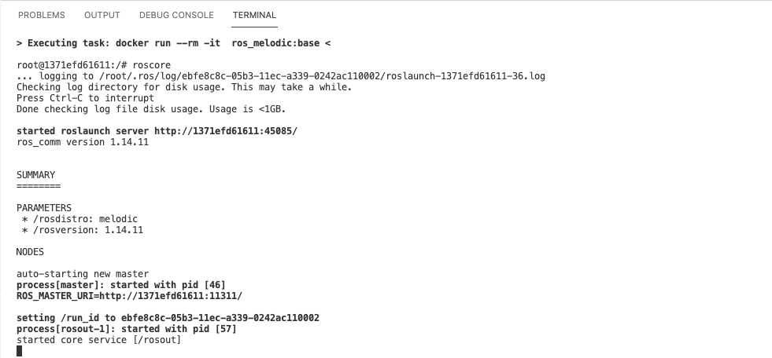
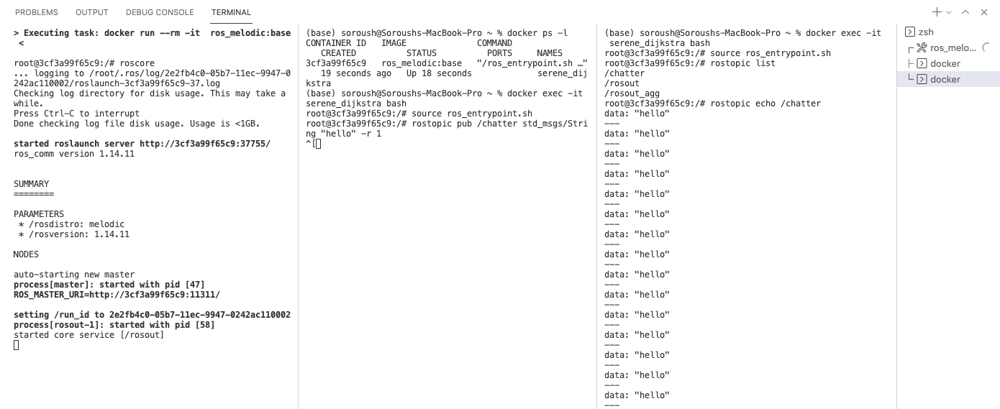
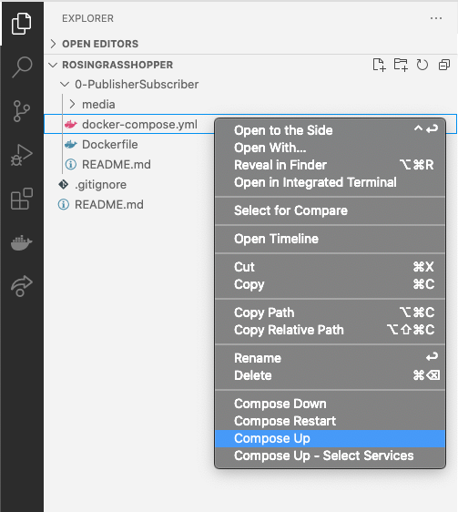
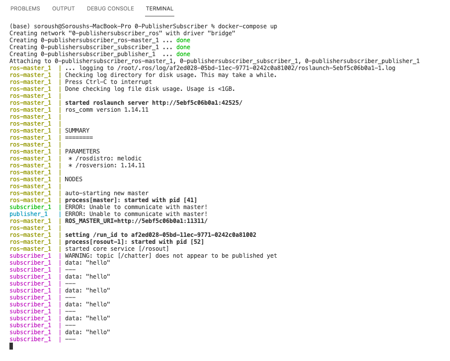
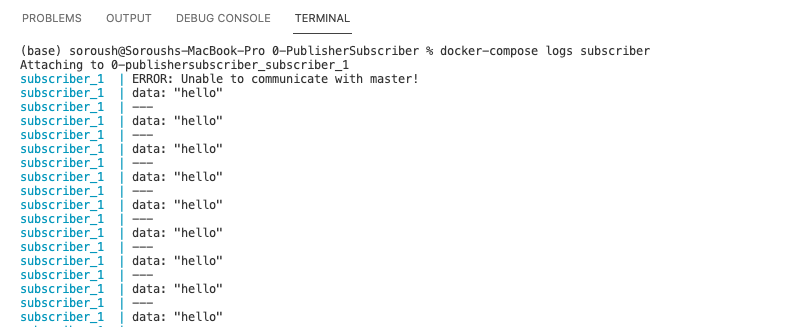

# Docker
Docker is an open source containerization platform. It enables developers to package applications into containers (standardized executable components) combining application source code with the operating system (OS) libraries and dependencies required to run that code in any environment.

You can use Docker instead of a [virtual] operating system to run your programs in any environment. For our purpose we will use Docker to create Ubuntu images which contain ROS applications. We can run these containers in any environment such as Windows or Mac.

There are two main files used to install an image and run docker containers.
- Dockerfile `set of instructions to build an image`
- docker-compose.yml `set of instruction to run one or multiple containers`

## Dockerfile
Dockerfile consists of specific commands that guide you on how to build a specific Docker image. 

The specific commands you can use in a dockerfile are:

FROM, PULL, RUN, and CMD
```
FROM - Creates the base layer for your image (for ex. ubuntu:18.04)
PULL - Adds files from your Docker repository
RUN - Builds your container
CMD - Specifies what command to run within the container
```

Below is a minimal example of the dockerfile to build a ROS Melodic image

```
FROM ros:melodic
RUN apt-get update
```

additionaly we can install some libraries for our image:
```
FROM ros:melodic
RUN apt-get update && \
    apt-get install -y ros-melodic-rosbridge-suite && \
    apt-get install -y ros-melodic-ros-tutorials && \
    apt-get install -y ros-melodic-common-tutorials
```

## Building our first "image" using Dockerfile
- Make sure your Docker Desktop software is running
- Open the folder where you have the Dockerfile in VSCode
- Press Ctrl(or Cmd) + Shift + P
- In the bar opened, type:
```
 Docker Images : Build Image
```
- Enter a name for the image with this structure:
- name:tag
```
- for ex >> ros_melodic_:base
```

## Running the ROS container from terminal
- In VSCode, on the left bar, select Docker extention
- From your IMAGES tab, select the newly created image `ros_melodic` and select the version which you created `base`
Right click and select "Run Interactive"

    

**Terminal 1**

- You can see your container running in the terminal. 
now you can try to run ROS using:
```
roscore
```


## Subscriber and Publisher example
Now that we have the `roscore` running, we can run two other containers for a [subscriber and publisher example](http://wiki.ros.org/ROS/Tutorials/WritingPublisherSubscriber%28python%29).

**Terminal 2**

Open a new terminal in VSCode and list the running containers:
```
docker ps -l
```

Using the name of the container as the ID, in writing this tutorial docker happened to assign the string `"keen_bose"`, we can start additional bash session in the same container by running:
```
docker exec -it keen_bose bash
```
Once inside, we'll need to setup our environment. The best way to do this is to using the entrypoint script included in the docker image:

```
source ros_entrypoint.sh
```
To start publishing a message try:
```
rostopic pub /chatter std_msgs/String "hello" -r 1
```

**Terminal 3**

Open the third terminal to run the subscriber:

You can get the list of available topics using `rostopic list`
```
docker exec -it keen_bose bash
source ros_entrypoint.sh
rostopic list
```

Here you may find the following topics:
```
/chatter
/rosout
/rosout_agg
```

We would subscribe to the `/chatter` to subscribe to the previous publisher node that we created.

```
rostopic echo /chatter
```

Here is an overview of all three terminals running together:



## Docker Compose
Now that you have an appreciation for PublisherSubscriber in ROS example manually, lets try and automate it using docker-compose.
Create a yaml file named docker-compose.yml in the same directory and paste the following inside:
```
version: '2'

networks:
  ros:
    driver: bridge

services:
  ros-master:
    image: ros_melodic:base
    command: stdbuf -o L roscore
    networks:
      - ros
    restart: always

  publisher:
    image: ros_melodic:base
    depends_on:
      - ros-master
    environment:
      - "ROS_MASTER_URI=http://ros-master:11311"
      - "ROS_HOSTNAME=publisher"
    command: rostopic pub /chatter std_msgs/String "hello" -r 1
    networks:
      - ros
    restart: always

  subscriber:
    image: ros_melodic:base
    depends_on:
      - ros-master
    environment:
      - "ROS_MASTER_URI=http://ros-master:11311"
      - "ROS_HOSTNAME=subscriber"
    command: rostopic echo /chatter
    networks:
      - ros
    restart: always

```
Right click on the docker-compose.yml file from your explorer menu in VSCode. and select `Compose Up`



Alternatively you can try this in terminal:
```
docker-compose up
```
or to run in background:
```
docker-compose up -d
```

Here is the output in terminal:



As well you can review the log outputs for each service separately:
In a new terminal from the folder containing docker-compose.yml, try:

```
docker-compose logs subscriber
```



to shut-down your containers / ROS nodes, you can use:
```
docker-compose down
```


# Additional Resources
- [List of available ROS images on Docker](https://registry.hub.docker.com/_/ros/)
- [Docker compose | ROS](http://wiki.ros.org/docker/Tutorials/Compose)
- [ROS Publisher-Subscriber example](http://wiki.ros.org/ROS/Tutorials/WritingPublisherSubscriber%28python%29)
- [ROS Apps Deployment](https://github.com/themousepotato/ROSAppsDeployment)
- [Docker Compose 'Getting Started'](https://docs.docker.com/compose/gettingstarted/)