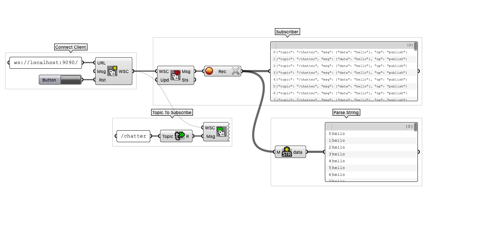

The following tutorial extends the previous [HelloWorld](https://github.com/MRAC-IAAC/ROSinGrasshopper/tree/main/00-HelloWorld%20in%20Docker) tutorial in grasshopper environment using two methods:
1. Compas Fab
2. Bengesht


# COMPAS FAB

## Update Docker-Compose 
First we start by updating the previous `[docker-compose](https://github.com/MRAC-IAAC/ROSinGrasshopper/blob/main/00-HelloWorld%20in%20Docker/docker-compose.yml)` from our previous excersie using few modifications:

**Base Image**

In this tutorial we use `gramaziokohler/ros-base:20.11` image instead of our previous `ros_melodic:base` image.
We modify this for all our services.

**ROS Bridge**

We add a new service called `ros-bridge` which provides ROS communication with Grasshopper through WebSockets. You can read more in [here](https://wiki.ros.org/rosbridge_suite).

**Ports**

Additionaly we define the ports which we would like to expose from Docker. This is necessary to communicate with Docker from our host OS.

```
version: '2.1'

services:
  ros-master:
    image: gramaziokohler/ros-base:20.11
    ports:
      - "11311:11311"
    command: stdbuf -o L roscore
    restart: always

  publisher:
    image: gramaziokohler/ros-base:20.11
    depends_on:
      - ros-master
    environment:
      - "ROS_MASTER_URI=http://ros-master:11311"
      - "ROS_HOSTNAME=publisher"
    command: rostopic pub /chatter std_msgs/String "hello" -r 0.1
    restart: always

  subscriber:
    image: gramaziokohler/ros-base:20.11
    depends_on:
      - ros-master
    environment:
      - "ROS_MASTER_URI=http://ros-master:11311"
      - "ROS_HOSTNAME=subscriber"
    command: rostopic echo /chatter
    restart: always

  ros-bridge:
    image: gramaziokohler/ros-base:20.11
    container_name: ros-bridge
    environment:
      - "ROS_HOSTNAME=ros-bridge"
      - "ROS_MASTER_URI=http://ros-master:11311"
    ports:
      - "9090:9090"
    depends_on:
      - ros-master
    command:
      - roslaunch
      - --wait
      - rosbridge_server
      - rosbridge_websocket.launch
```

The `docker-compose` file is ready to run. We can test this using:
```
docker-compose up
```


We will keep this running in the background.

## Grasshopper Subscriber using Compas Fab

Now let's move to the grasshopper side.
We need to have Compas Fab for rhino and grasshopper installed. as well as, GhPython plugin for Grasshopper.

We will use GhPython to write some simple Python scripts in grasshopper which use compas_fab library in Python.

**Client Connection**

First we create a component to connect to the ROS Bridge Server from Grasshopper.
in GhPython:

```
from compas_fab.backends import RosClient

client = RosClient()

if connect is True:
    client.run()
    print('Connected: ', client.is_connected)
    
elif connect is False:
    client.close()
```

**Subscriber**

Then we create another component which subscribes to the `/chatter` topic and prints the output.

```
from roslibpy import Topic
from compas_fab.backends import RosClient

def receive_message(message):
    print('Heard talking: ' + message['data'])

with RosClient() as client:
    listener = Topic(client, /chatter, 'std_msgs/String')

    if read and client.is_connected:
        listener.subscribe(receive_message)
```
You can note that the connected clients in VSCode terminal shows the connection to the Docker client as well.

Here is the overall [code](https://github.com/MRAC-IAAC/ROSinGrasshopper/raw/main/01-HelloWorld%20in%20Grasshopper/Subscriber_CompasFab.gh):


## Grasshopper Subscriber using Bengesht
Alternative to Compas fab, we can use Bengesht + ROS.GH plugins in grasshopper to communicate with ROS Bridge Server.

>Our docker container is running on the localhost, therefore we can use this ip for the Bengesht client:
>
>ws://localhost:9090/

Here is how the [code](https://github.com/MRAC-IAAC/ROSinGrasshopper/raw/main/01-HelloWorld%20in%20Grasshopper/Subscriber_Bengesht.gh) looks like:


# Additional Resources
- [Compas Fab Working in Rhino](https://gramaziokohler.github.io/compas_fab/latest/getting_started.html#working-in-rhino-1)
- [ROS Bridge Suite](https://wiki.ros.org/rosbridge_suite)
- [ROS in Compas Fab](https://gramaziokohler.github.io/compas_fab/latest/backends/ros.html#ros-backend)
- [Compas Fab PublisherSubscriber example](https://gramaziokohler.github.io/compas_fab/latest/examples/03_backends_ros/01_ros_examples.html)
- [Bengesht + ROS.GH Demo](https://vimeo.com/159845598)
