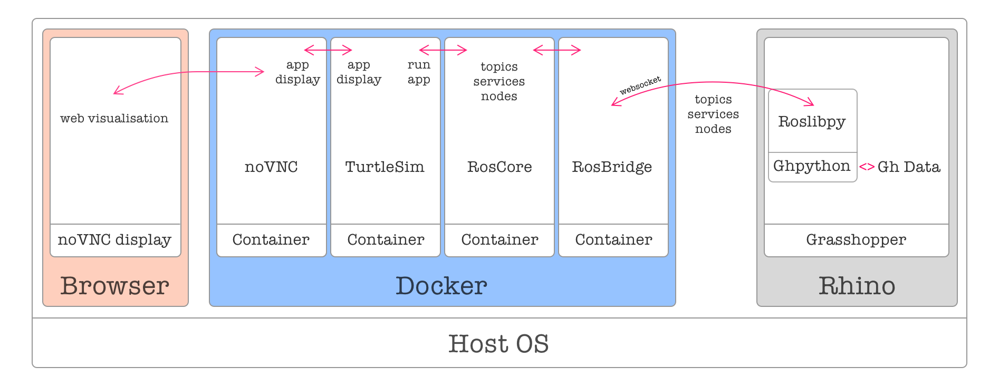

# Turtlesim

[Turtlesim](http://wiki.ros.org/turtlesim) is a tool made for teaching ROS basics. In this example we explore:

- How to add GUI (Graphical User Interface) for our containers.
- Few basic concepts of ROS using [roslibpy](https://roslibpy.readthedocs.io/en/latest/index.html) library: Nodes, Topics and Services.

## Installation

### Dockerfile

We'll prepare the Dockerfile to install the turtlesim package:

```Dockerfile
FROM osrf/ros:melodic-desktop-full

RUN apt-get update && apt-get install -y \
    ros-melodic-rosbridge-suite \
    ros-melodic-turtlesim && \
    # Clear apt-cache to reduce image size
    rm -rf /var/lib/apt/lists/*
```

Then we can build our docker image. ([instructions](https://github.com/MRAC-IAAC/ROSinGrasshopper/tree/main/00-HelloWorld%20in%20Docker#building-our-first-image-using-dockerfile))

```Bash
ros_melodic:turtlesim
```

### GUI

To access gui of our containers, there are two main possible methods:

#### Visualization forwarding display

Visit [here](https://gramaziokohler.github.io/compas_fab/latest/backends/web_x11_gui.html#visualization-forwarding-display-1) for more info.

#### Visualization over web browser
  
We use this method since it's the easiest option. The display of the container with graphical information (for example Rviz, Gazebo, etc.) is forwarded to another container that serves it over a web connection, making it available from your browser. The visualiser container we use is thanks to [theasp/novnc](https://hub.docker.com/r/theasp/novnc/).

### Docker Compose

We will use 4 containers:

- ros-master `our roscore`
- ros-bridge `linking ros to grasshopper/python environment`
- turtlesim `our main application`
- nonvc `visualising turtlesim container on browser`

In turtlesim container `DISPLAY` is exposed to your novnc container `DISPLAY=novnc:0.0`.

## Running ROS Nodes

Run your ros nodes using `docker-compose`:

```Bash
docker-compose up
```

To access the GUI, Start your browser and go to the following address:

```Link
http://0.0.0.0:8080/vnc.html
```

Here is an overview of how containers, noVNC GUI and Grasshopper work together.



## Grasshopper Script

Open the grasshopper [file](Turtlesim.gh) to interact with the turtle in ROS.

### Moving the turtle using ROS Topics

Use the `/cmd_vel` topic to send linear and angular velocity commands for the turtle. For this we will create a publisher component using ghpython.
Use rostopics to send the commands which you would need them to happen frequently.


### Using ROS Services

In addition to moving the turtle using `cmd_vel` publisher, we can access some other features of the enviornment using ROS Services.
For example, to clean the background, to move the turtle to initial position, etc.
Services are the commands we would like to send once in a while.

Call the `/clear` service to clear the background.


to shut-down your containers / ROS nodes, you can use:

```bash
docker-compose down --remove-orphans
```

## Additional Resources

- [OSRF/ROS Docker Images](https://hub.docker.com/r/osrf/ros/tags?page=1&ordering=last_updated)
- [noVNC Display Container](https://hub.docker.com/r/theasp/novnc)
- [roslibpy: ROS Bridge library](https://roslibpy.readthedocs.io/en/latest/index.html)
- [Creating ghpython sticky variables](https://developer.rhino3d.com/guides/rhinopython/ghpython-global-sticky/)
- [Getting Started with Turtlesim](http://wiki.ros.org/turtlesim)
- *grasshopper file requires [Human Plugin](https://www.food4rhino.com/en/app/human) for grasshopper.*
