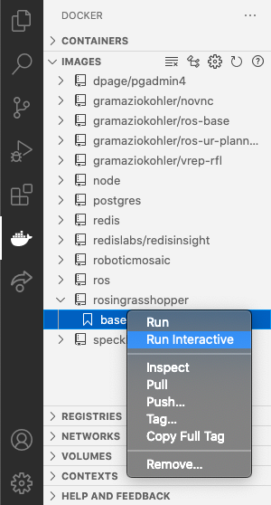
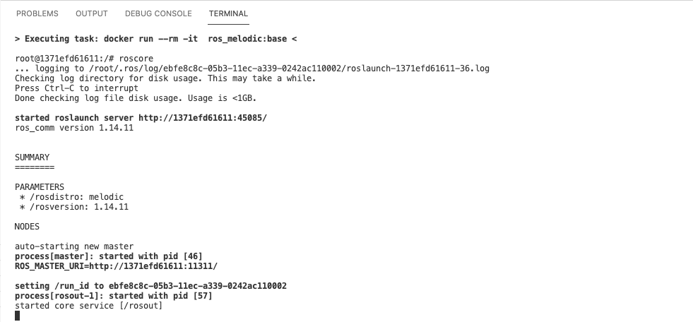

# Docker
Docker is an open source containerization platform. It enables developers to package applications into containers (standardized executable components) combining application source code with the operating system (OS) libraries and dependencies required to run that code in any environment.

You can use Docker instead of a [virtual] operating system to run your programs in any environment. For our purpose we will use Docker to create Ubuntu images which contain ROS applications. We can run these containers in any environment such as Windows or Mac.

There are two main files used to install an image and run docker containers.
- Dockerfile `set of instructions to build an image`
- docker-compose.yml `set of instruction to run one or multiple containers`

## Dockerfile
Dockerfile consists of specific commands that guide you on how to build a specific Docker image. 

The specific commands you can use in a dockerfile are:

FROM, PULL, RUN, and CMD
```
- FROM - Creates a layer from the ubuntu:18.04
- PULL - Adds files from your Docker repository
- RUN - Builds your container
- CMD - Specifies what command to run within the container
```

Below is a minimal example of the dockerfile to build a ROS Melodic image

```
FROM ros:melodic
RUN apt-get update
```

## Building your first "image" using Dockerfile
- Make sure your Docker Desktop software is running
- Open the folder where you have the Dockerfile in VSCode
- Press Ctrl(or Cmd) + Shift + P
- In the bar opened, type:
    - Docker Images : Build Image
- Enter a name for the image with this structure:
    - name:tag
    - for ex >> `rosingrasshopper:base`

## Running the ROS container from terminal
- In visual studio code, on the left bar, select Docker extention
- From your IMAGES tab, select the newly created image `rosingrasshopper` and select the version which you created `base`
    - Right click and select "Run Interactive"

    

- You can see your container running in the terminal. 
now you can try to run ROS using:
    - roscore

    

# Additional Resources
 [List of available ROS images on Docker](https://registry.hub.docker.com/_/ros/)
 [Docker compose | ROS](`http://wiki.ros.org/docker/Tutorials/Compose`)
 